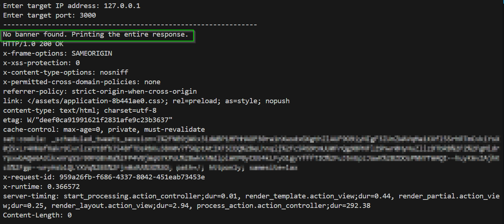

# BannerGrabber

A simple Python script to grab the server banner from a given IP address and port using a minimal HTTP request.

## Usage
1. Run the script.
2. Enter the target IP address when prompted.
3. Enter the target port number when prompted.
4. The script will display the server banner if found, or print the full response.

### Sample Response
