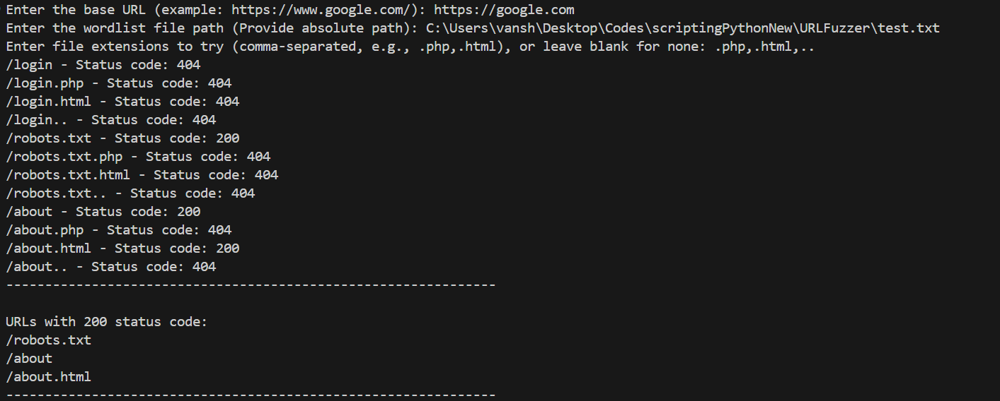

# URLFuzzer

A simple Python script to fuzz URLs and discover valid paths or files on a web server using a wordlist and optional file extensions.

## Usage
1. Run the script.
2. Enter the base URL (e.g., https://example.com/).
3. Enter the absolute path to your wordlist file.
4. Optionally, enter file extensions to try (comma-separated, e.g., .php,.html), or leave blank for none.
5. The script will print the status code for each path and list all URLs that return a 200 status code.

### Sample Response

